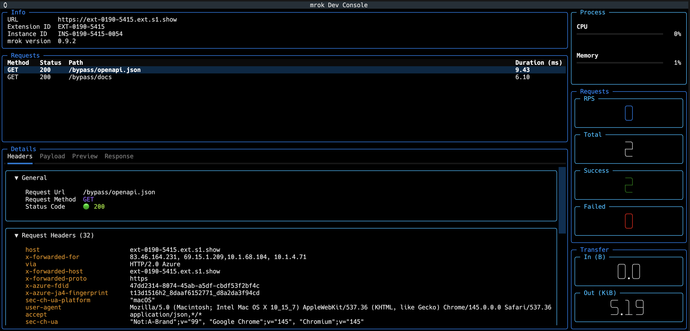

# SoftwareOne Marketplace Platform Extension Example

This is a reference implementation demonstrating how to build a SoftwareOne Marketplace Platform extension. The example is designed to be **human-friendly** with clear documentation and **agent-friendly** with well-structured code and comprehensive docstrings to enable effective code generation and analysis.

## Quick Start

### Prerequisites

To develop/run this extension you can choose between two different options:

1. Docker (using [compose.yaml](compose.yaml))
     - Build the app service:
         ```bash
         docker compose build
         ```
     - Enter the bash shell of the container for development purposes:
         ```bash
         docker compose run --rm bash
         ```
     - Run the extension application:
         ```bash
         docker compose run --rm app
         ```

2. Local machine
     - Install Node.js: https://nodejs.org/en/download
     - Install uv: https://docs.astral.sh/uv/getting-started/installation/


### Setup Extension

1. In your vendor account, create a new extension
2. In the extension detail view, navigate to the **Service** section and copy the **Extension Secret**
3. Update the `settings.yaml` file with your `extension_id` and set `env_domain` if you target dev/test/staging
4. Create a `.secrets.yaml` file in the project root with the following content:
    ```yaml
    api_key: <your-extension-secret>
    ```

### Build Frontend

Install frontend dependencies and build the bundles:
```bash
cd frontend
npm install
npm run build
```

Script details (from package.json):
- `build:types`: Type-check and emit types using `tsc -p tsconfig.json`
- `build:code`: Bundle JS/CSS using `node esbuild.config.js`
- `build`: Runs `build:types` then `build:code`
- `start`: Watch mode for local development (runs types + bundler in parallel)

Watch mode:
```bash
cd frontend
npm run start
```

### Install Backend Dependencies

Use `uv` to create the virtual environment and install Python dependencies:
```bash
cd backend
uv sync
```

### Run Extension

Start the extension using:
```bash
runext
```

### Run mrok Development Console

Once the extension started you can run the mrok Development Console to spy the traffic.
In a new terminal window run:

```bash
mrok agent dev console
```




You can also run the web version or the development console:

```bash
mrok agent dev web
```


## Project Structure

The complete repository structure has been moved to [docs/project-structure.md](docs/project-structure.md) to keep this README concise.

High-level layout:

- `backend/`: FastAPI service and extension runtime logic
- `frontend/`: UI source and build config (file layout may evolve)
- `static/`: generated frontend bundles served by backend
- `docs/`: additional technical documentation
- root config files: `meta.yaml`, `settings.yaml`, `compose.yaml`, `Dockerfile`, `identity.json`

### Key Components

**Backend (FastAPI)**
- `main.py`: Bootstrap entry point that initializes and runs the extension via `runext` CLI
- `extension.py`: Declares the FastAPI application instance and mounts static file serving for frontend assets
- `api.py`: Defines API routes and webhook handlers for platform events and validations
- `config.py`: Manages settings loading from `settings.yaml` and environment variables
- `schema.py`: Pydantic models for type-safe request/response validation
- `auth.py`: FastAPI dependency to inject the authentication context into the endpoint handlers.
- `client.py`: HTTPX based Marketplace API client with built-in support for authentication in the scope of an installation.


**Frontend (Multi-Socket Architecture)**
- Multiple entry points for different platform sockets (dashboard, accounts, settings, etc.)
- Each socket is compiled into a separate JavaScript bundle during the build process
- `esbuild.config.js` handles separate bundle generation for each socket
- Built bundles are placed in `/static` for serving by the backend

**Configuration**
- `meta.yaml`: Jinja2 template declaring extension capabilities, hooks, events, and plugs. Supports dynamic values from `settings.yaml`
- `settings.yaml`: Public configuration values (extension_id, product_id, API endpoints, domain settings). Defaults target production; change `env_domain` for dev/test/staging.
- `.secrets.yaml`: Sensitive data like API keys and secrets (must be created locally, never committed)

**Deployment**
- `Dockerfile`: Container image for production deployment
- `compose.yaml`: Local development environment setup

## Developer Guides

- [Project Settings](docs/settings.md) — Detailed docs about project settings.
- [Injectable Dependencies](docs/injectable-dependencies.md) — FastAPI injectable dependencies
- [Project Structure](docs/project-structure.md) — Detailed repository layout and file organization
- [Adding Event Handlers](docs/adding-event-handlers.md) — Subscribe to and process platform events
